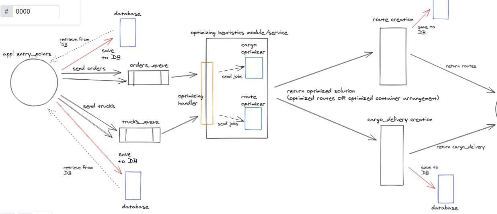

# Rubbi Truck Planner
This API aims to provide optimizing heuristics for arrangement of cargo containers 
and routes for trucks

The idea is to implement the following system design flow

#How to run
This README documents whatever steps are necessary to get the
application up and running.

Things you may want to cover

* Configuration
``bundle install``

* Database creation & Database initialization
``rails db:migrate``

* How to run the test suite
``rspec /spec/{path/to/spec_test.rb}``

* Services (job queues, cache servers, search engines, etc.)

* Deployment instructions
